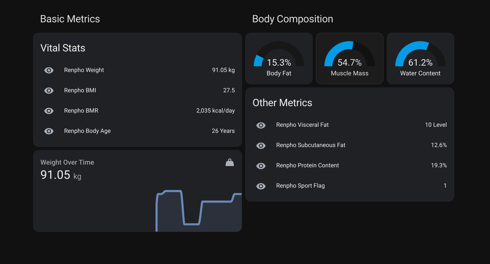
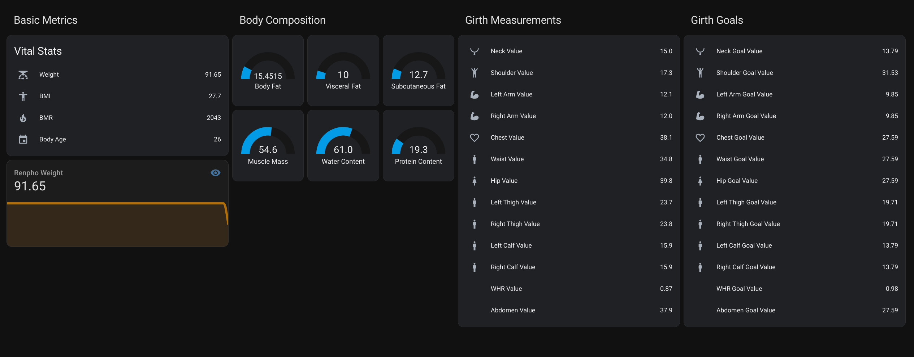

# Renpho Weight Home Assistant Component
# IN DEVELOPPEMENT (Not Working)


[](https://github.com/hacs/integration)
[](https://github.com/antoinebou12/hass_renpho/releases/latest)
[](https://analytics.home-assistant.io/custom_integrations.json&query=$.hass_renpho.total)

[](https://my.home-assistant.io/redirect/hacs_repository/?owner=antoinebou12&repository=hass_renpho&category=Integration)

## Overview

This custom component allows you to integrate Renpho's weight scale data into Home Assistant. It fetches weight and various other health metrics and displays them as sensors in Home Assistant.

Go to try the API with your data: https://hass-renpho.vercel.app/docs

Install renpho outdated
https://github.com/antoinebou12/hass_renpho/assets/13888068/0bf0e48f-0582-462a-b0a2-6572dd63c860

Use http proxy for the app here a list https://hidemy.io/en/proxy-list/?type=s#list

## Install config


### Weight


### Complete View





## Table of Contents

- [Prerequisites](#prerequisites)
- [Installation](#installation)
- [Configuration](#configuration)
- [Updates](#updates)
- [Roadmap](#roadmap)
- [License](#license)

## Prerequisites

1. You must have a Renpho scale. If you don't have one, you can purchase one [here](https://renpho.com/collections/body-fat-scale).
2. You must have the Renpho app installed on your mobile device. You can download it [here](https://play.google.com/store/apps/details?id=com.qingniu.renpho&hl=en_US&pli=1) for Android and [here](https://apps.apple.com/ca/app/renpho/id1219889310) for iOS.
4. You must have the [Home Assistant Community Store (HACS)](https://hacs.xyz/) installed and running.

## Installation

```
Stable
Use the latest release

Not stable
git clone https://github.com/antoinebou12/hass_renpho
```

Copy this folder to `<config_dir>/custom_components/renpho/`.

## Configuration

Add the following entry in your `configuration.yaml`:

```yaml
renpho:
  email: test@test.com # email address
  password: MySecurePassword # password
  user_id: 123456789 # user id (optional)
  refresh: 600 # time to poll (ms)
```

And then add the sensor platform:

```yaml
sensor:
  platform: renpho
```

> :warning: Note: Refresh is the time in seconds to check for updates. Keep in mind that logging in will log you out of the app.

Restart home assistant and you should see the sensors:

## Supported Metrics

### General Information

| Metric        | Description                                  | Data Type | Unit of Measurement |
| ------------- | -------------------------------------------- | --------- | ------------------- |
| id            | Unique identifier for the record             | Numeric   | N/A                 |
| b_user_id     | Unique identifier for the user               | Numeric   | N/A                 |
| time_stamp    | Unix timestamp for the record                | Numeric   | UNIX Time           |
| created_at    | Time the data was created                    | DateTime  | N/A                 |
| created_stamp | Unix timestamp for when the data was created | Numeric   | UNIX Time           |

### Device Information

| Metric         | Description               | Data Type | Unit of Measurement |
| -------------- | ------------------------- | --------- | ------------------- |
| scale_type     | Type of scale used        | Numeric   | N/A                 |
| scale_name     | Name of the scale         | String    | N/A                 |
| mac            | MAC address of the device | String    | N/A                 |
| internal_model | Internal model code       | String    | N/A                 |
| time_zone      | Time zone information     | String    | N/A                 |

### User Profile

| Metric      | Description            | Data Type | Unit of Measurement |
| ----------- | ---------------------- | --------- | ------------------- |
| gender      | Gender of the user     | Numeric   | N/A                 |
| height      | Height of the user     | Numeric   | cm                  |
| height_unit | Unit for height        | Numeric   | N/A                 |
| birthday    | Birth date of the user | Date      | N/A                 |

### Physical Metrics

| Metric    | Description         | Data Type | Unit of Measurement |
| --------- | ------------------- | --------- | ------------------- |
| weight    | Body weight         | Numeric   | kg                  |
| bmi       | Body Mass Index     | Numeric   | N/A                 |
| muscle    | Muscle mass         | Numeric   | %                   |
| bone      | Bone mass           | Numeric   | %                   |
| waistline | Waistline size      | Numeric   | cm                  |
| hip       | Hip size            | Numeric   | cm                  |
| stature   | Stature information | Numeric   | cm                  |

### Body Composition

| Metric  | Description               | Data Type | Unit of Measurement |
| ------- | ------------------------- | --------- | ------------------- |
| bodyfat | Body fat percentage       | Numeric   | %                   |
| water   | Water content in the body | Numeric   | %                   |
| subfat  | Subcutaneous fat          | Numeric   | %                   |
| visfat  | Visceral fat level        | Numeric   | Level               |

### Metabolic Metrics

| Metric  | Description                 | Data Type | Unit of Measurement |
| ------- | --------------------------- | --------- | ------------------- |
| bmr     | Basal Metabolic Rate        | Numeric   | kcal/day            |
| protein | Protein content in the body | Numeric   | %                   |

### Age Metrics

| Metric  | Description              | Data Type | Unit of Measurement |
| ------- | ------------------------ | --------- | ------------------- |
| bodyage | Estimated biological age | Numeric   | Years               |

Certainly, you can expand the existing table to include the "Unit of Measurement" column for each metric. Here's how you can continue to organize the metrics into categories, similar to your previous table, but now with the added units:

### Electrical Measurements (not sure if this is the correct name)

| Metric                  | Description                            | Data Type | Unit of Measurement |
| ----------------------- | -------------------------------------- | --------- | ------------------- |
| resistance              | Electrical resistance                  | Numeric   | Ohms                |
| sec_resistance          | Secondary electrical resistance        | Numeric   | Ohms                |
| actual_resistance       | Actual electrical resistance           | Numeric   | Ohms                |
| actual_sec_resistance   | Actual secondary electrical resistance | Numeric   | Ohms                |
| resistance20_left_arm   | Resistance20 in the left arm           | Numeric   | Ohms                |
| resistance20_left_leg   | Resistance20 in the left leg           | Numeric   | Ohms                |
| resistance20_right_leg  | Resistance20 in the right leg          | Numeric   | Ohms                |
| resistance20_right_arm  | Resistance20 in the right arm          | Numeric   | Ohms                |
| resistance20_trunk      | Resistance20 in the trunk              | Numeric   | Ohms                |
| resistance100_left_arm  | Resistance100 in the left arm          | Numeric   | Ohms                |
| resistance100_left_leg  | Resistance100 in the left leg          | Numeric   | Ohms                |
| resistance100_right_arm | Resistance100 in the right arm         | Numeric   | Ohms                |
| resistance100_right_leg | Resistance100 in the right leg         | Numeric   | Ohms                |
| resistance100_trunk     | Resistance100 in the trunk             | Numeric   | Ohms                |

### Cardiovascular Metrics

| Metric        | Description   | Data Type | Unit of Measurement |
| ------------- | ------------- | --------- | ------------------- |
| heart_rate    | Heart rate    | Numeric   | bpm                 |
| cardiac_index | Cardiac index | Numeric   | N/A                 |

### Other Metrics

| Metric           | Description                          | Data Type | Unit of Measurement |
| ---------------- | ------------------------------------ | --------- | ------------------- |
| method           | Method used for measurement          | Numeric   | N/A                 |
| sport_flag       | Sports flag                          | Numeric   | N/A                 |
| left_weight      | Weight on the left side of the body  | Numeric   | kg                  |
| right_weight     | Weight on the right side of the body | Numeric   | kg                  |
| waistline        | Waistline size                       | Numeric   | cm                  |
| hip              | Hip size                             | Numeric   | cm                  |
| local_created_at | Local time the data was created      | DateTime  | N/A                 |
| time_zone        | Time zone information                | String    | N/A                 |
| remark           | Additional remarks                   | String    | N/A                 |
| score            | Health score                         | Numeric   | N/A                 |
| pregnant_flag    | Pregnancy flag                       | Numeric   | N/A                 |
| stature          | Stature information                  | Numeric   | cm                  |
| category         | Category identifier                  | Numeric   | N/A                 |

### Girth Measurements

| Metric            | Description       | Data Type | Unit of Measurement | Category     | Label              |
| ----------------- | ----------------- | --------- | ------------------- | ------------ | ------------------ |
| neck_value        | Neck Value        | Numeric   | cm                  | Measurements | Girth Measurements |
| shoulder_value    | Shoulder Value    | Numeric   | cm                  | Measurements | Girth Measurements |
| arm_value         | Arm Value         | Numeric   | cm                  | Measurements | Girth Measurements |
| chest_value       | Chest Value       | Numeric   | cm                  | Measurements | Girth Measurements |
| waist_value       | Waist Value       | Numeric   | cm                  | Measurements | Girth Measurements |
| hip_value         | Hip Value         | Numeric   | cm                  | Measurements | Girth Measurements |
| thigh_value       | Thigh Value       | Numeric   | cm                  | Measurements | Girth Measurements |
| calf_value        | Calf Value        | Numeric   | cm                  | Measurements | Girth Measurements |
| left_arm_value    | Left Arm Value    | Numeric   | cm                  | Measurements | Girth Measurements |
| left_thigh_value  | Left Thigh Value  | Numeric   | cm                  | Measurements | Girth Measurements |
| left_calf_value   | Left Calf Value   | Numeric   | cm                  | Measurements | Girth Measurements |
| right_arm_value   | Right Arm Value   | Numeric   | cm                  | Measurements | Girth Measurements |
| right_thigh_value | Right Thigh Value | Numeric   | cm                  | Measurements | Girth Measurements |
| right_calf_value  | Right Calf Value  | Numeric   | cm                  | Measurements | Girth Measurements |
| whr_value         | WHR Value         | Numeric   | ratio               | Measurements | Girth Measurements |
| abdomen_value     | Abdomen Value     | Numeric   | cm                  | Measurements | Girth Measurements |

---

### Girth Goals

| Metric                 | Description            | Data Type | Unit of Measurement | Category | Label       |
| ---------------------- | ---------------------- | --------- | ------------------- | -------- | ----------- |
| neck_goal_value        | Neck Goal Value        | Numeric   | cm                  | Goals    | Girth Goals |
| shoulder_goal_value    | Shoulder Goal Value    | Numeric   | cm                  | Goals    | Girth Goals |
| arm_goal_value         | Arm Goal Value         | Numeric   | cm                  | Goals    | Girth Goals |
| chest_goal_value       | Chest Goal Value       | Numeric   | cm                  | Goals    | Girth Goals |
| waist_goal_value       | Waist Goal Value       | Numeric   | cm                  | Goals    | Girth Goals |
| hip_goal_value         | Hip Goal Value         | Numeric   | cm                  | Goals    | Girth Goals |
| thigh_goal_value       | Thigh Goal Value       | Numeric   | cm                  | Goals    | Girth Goals |
| calf_goal_value        | Calf Goal Value        | Numeric   | cm                  | Goals    | Girth Goals |
| left_arm_goal_value    | Left Arm Goal Value    | Numeric   | cm                  | Goals    | Girth Goals |
| left_thigh_goal_value  | Left Thigh Goal Value  | Numeric   | cm                  | Goals    | Girth Goals |
| left_calf_goal_value   | Left Calf Goal Value   | Numeric   | cm                  | Goals    | Girth Goals |
| right_arm_goal_value   | Right Arm Goal Value   | Numeric   | cm                  | Goals    | Girth Goals |
| right_thigh_goal_value | Right Thigh Goal Value | Numeric   | cm                  | Goals    | Girth Goals |
| right_calf_goal_value  | Right Calf Goal Value  | Numeric   | cm                  | Goals    | Girth Goals |
| whr_goal_value         | WHR Goal Value         | Numeric   | ratio               | Goals    | Girth Goals |
| abdomen_goal_value     | Abdomen Goal Value     | Numeric   | cm                  | Goals    | Girth Goals |

## Roadmap


1. Add support for all user information.
   ```yaml
   sensor:
     platform: renpho
     user: your_username # username, email, or something identifiable
   ```
2. Find a way to prevent logging out from the mobile app upon every login from Home Assistant (if feasible).

## License

MIT License. See `LICENSE` for more information.
